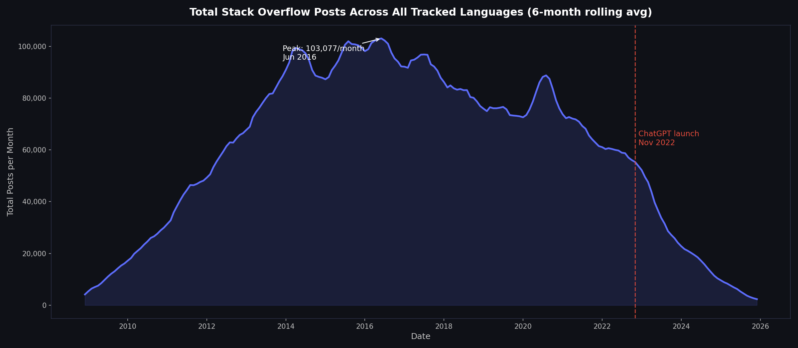
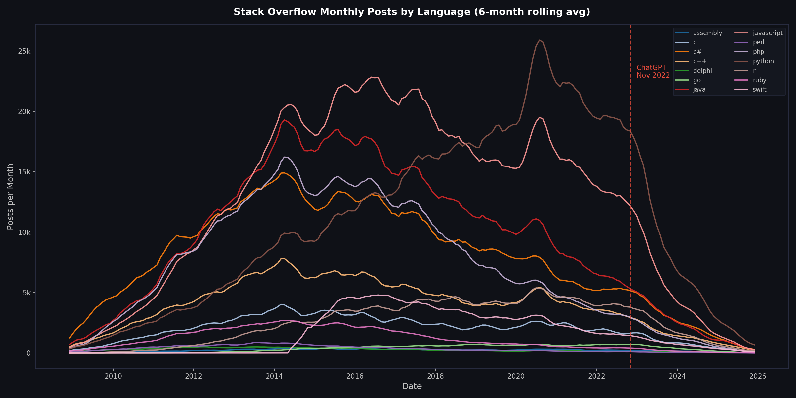
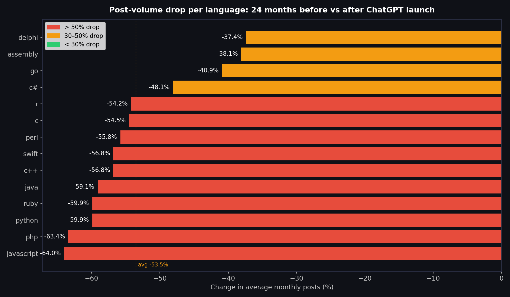
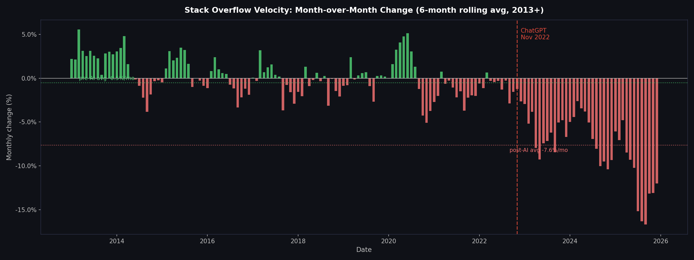
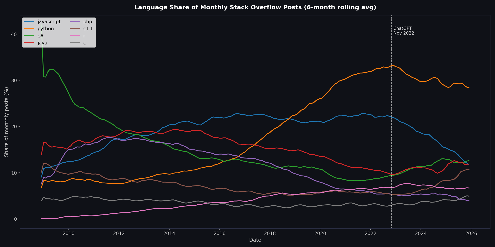
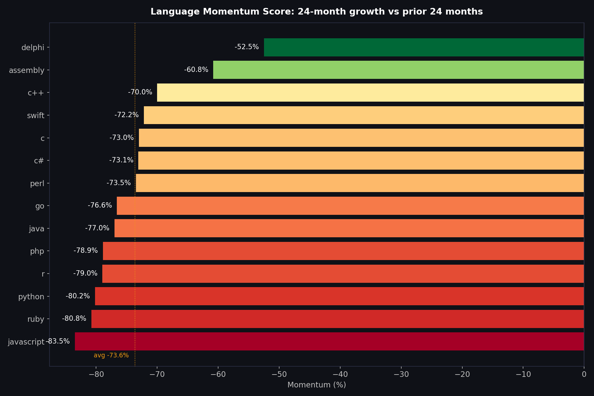
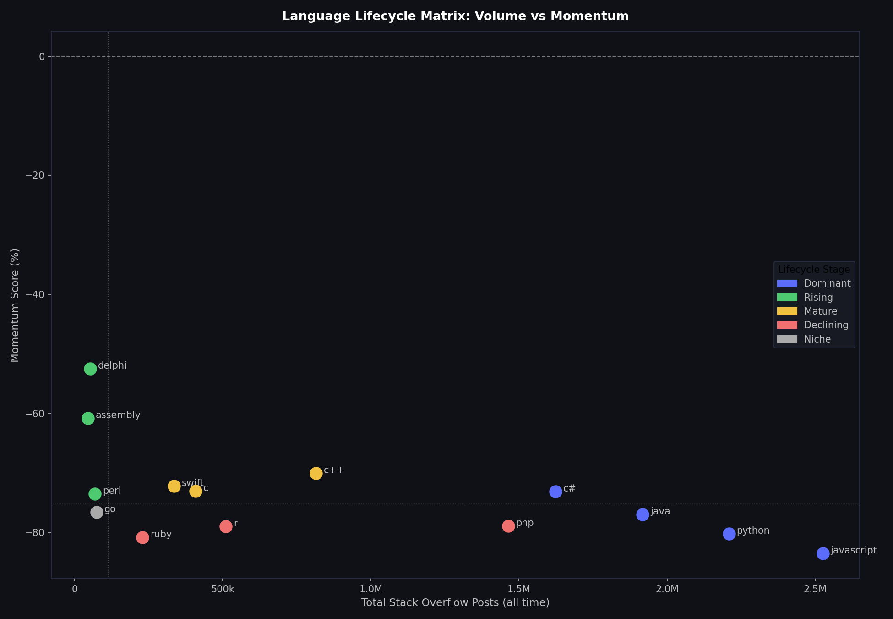
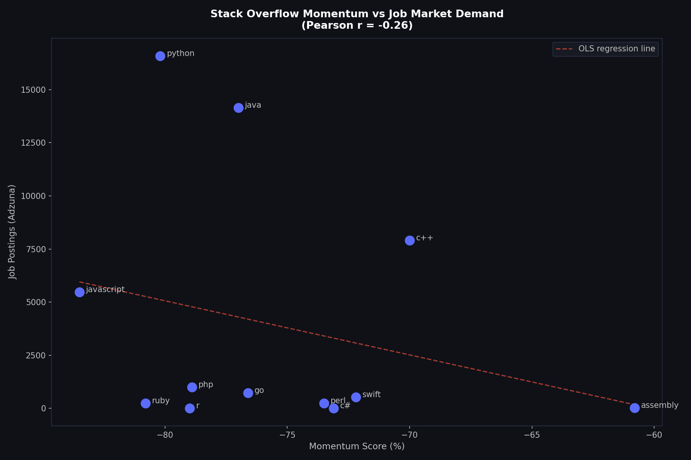
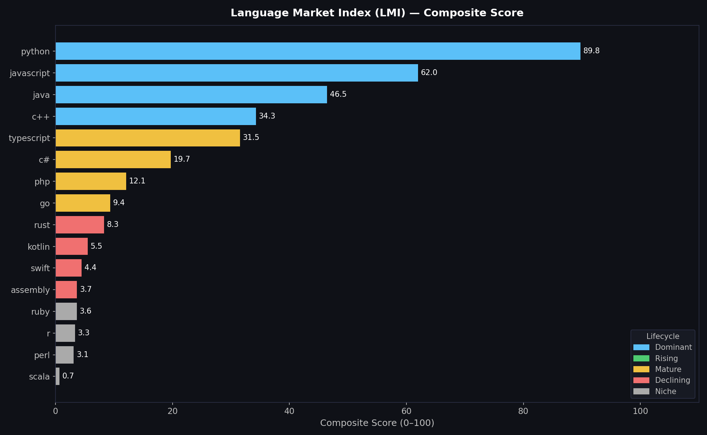
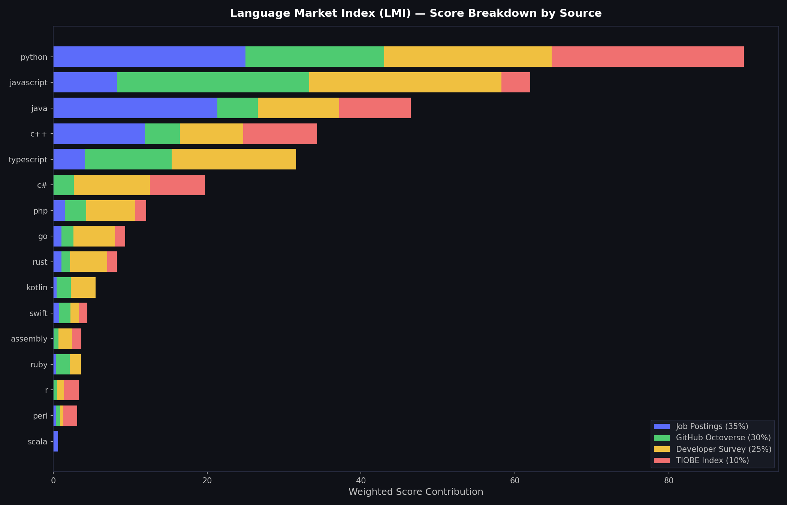

# Programming Language Workforce Strategy

Two-project analysis answering a single business question: **which programming languages should a technology consultancy be hiring and training for right now?**

Project 1 investigates Stack Overflow post-volume data to reveal what happened after ChatGPT launched. Project 2 builds a replacement signal — the **Language Market Index (LMI)** — a composite scoring system across four independent data sources.

**Project 1 → [notebooks/01_so_decline_analysis.ipynb](notebooks/01_so_decline_analysis.ipynb)**
&nbsp;&nbsp;·&nbsp;&nbsp;
**Project 2 → [notebooks/02_language_market_index.ipynb](notebooks/02_language_market_index.ipynb)**
&nbsp;&nbsp;·&nbsp;&nbsp;
**Dashboard → [dashboard/app.py](dashboard/app.py)** *(port 5001)*

---

## Table of Contents

0. [Prerequisites](#0-prerequisites)
1. [Quick Start](#1-quick-start)
2. [Project Structure](#2-project-structure)
3. [Datasets](#3-datasets)
4. [Project 1 — Is Stack Overflow Dying?](#4-project-1--is-stack-overflow-dying)
5. [Project 2 — Language Market Index](#5-project-2--language-market-index)
6. [Key Findings](#6-key-findings)
7. [Visualisations](#7-visualisations)
8. [Dashboard Architecture](#8-dashboard-architecture)
9. [Course Context](#9-course-context)
10. [Dependencies](#10-dependencies)

---

## 0. Prerequisites

- Python 3.11+
- pip
- Adzuna API credentials (free at [developer.adzuna.com](https://developer.adzuna.com)) — only needed to re-fetch job posting data

---

## 1. Quick Start

```bash
git clone <repo-url>
cd Day_73_Data_Visualisation_with_Matplotlib_Programming_Languages
pip install -r requirements.txt
cp .env.example .env   # add Adzuna credentials
```

### Run the analysis notebooks

```bash
jupyter notebook notebooks/01_so_decline_analysis.ipynb
jupyter notebook notebooks/02_language_market_index.ipynb
```

Select **Restart & Run All** in each. All charts save to `plots/`.

### Run the LMI pipeline (re-fetch all data sources)

```bash
cd pipeline
python run.py
```

Skip sources or recompute from cached data:

```bash
python run.py --skip-github --skip-so   # re-run Adzuna + TIOBE only
python run.py --only-score              # recompute index from cached data
```

### Run the interactive dashboard

```bash
cd dashboard
python app.py
# open http://localhost:5001
```

### Pipeline flow

```
pipeline/run.py
    │
    │  ── [Ingestion] ────────────────────────────────────────────────────────
    ├── SO post counts       →  data/raw/so/QueryResults.csv  (pre-downloaded)
    ├── Adzuna API           →  data/raw/adzuna/               (job postings)
    ├── GitHub Octoverse     →  data/raw/github/               (repo activity)
    ├── SO Developer Survey  →  data/raw/so_survey/            (usage survey)
    └── TIOBE Index          →  data/raw/tiobe/                (industry index)
    │
    │  ── [Processing] ───────────────────────────────────────────────────────
    ├── normalize.py   →  min-max scale each source to 0–100
    │                     data/processed/normalized.csv
    └── score.py       →  weighted composite + percentile lifecycle classification
                          data/processed/index.csv
    │
    │  ── [Analysis] ────────────────────────────────────────────────────────
    ├── notebooks/01_so_decline_analysis.ipynb   →  SO trend, momentum, lifecycle, correlation
    └── notebooks/02_language_market_index.ipynb →  LMI scores, sensitivity analysis
    │
    │  ── [Output] ──────────────────────────────────────────────────────────
    ├── plots/        →  10 chart PNGs
    └── dashboard/    →  interactive Flask dashboard (port 5001)
```

---

## 2. Project Structure

```
├── notebooks/
│   ├── 01_so_decline_analysis.ipynb        # Project 1: Is Stack Overflow Dying?
│   └── 02_language_market_index.ipynb      # Project 2: Language Market Index (LMI)
│
├── pipeline/
│   ├── run.py                              # Orchestrator — runs all ingestion + scoring
│   ├── ingestion/
│   │   ├── adzuna_fetch.py                 # Adzuna Jobs API
│   │   ├── github_fetch.py                 # GitHub Octoverse public data
│   │   ├── so_survey_parse.py              # Stack Overflow Developer Survey CSV
│   │   └── tiobe_scrape.py                 # TIOBE Index scraper (with hardcoded fallback)
│   └── processing/
│       ├── normalize.py                    # Min-max normalisation per source
│       └── score.py                        # Weighted composite + lifecycle classification
│
├── dashboard/
│   ├── app.py                              # Flask app (port 5001)
│   └── templates/index.html                # Two-tab Chart.js dashboard
│
├── data/
│   ├── raw/
│   │   ├── so/QueryResults.csv             # Stack Overflow monthly post counts (pre-downloaded)
│   │   ├── adzuna/                         # Job posting counts from Adzuna API
│   │   ├── github/                         # GitHub Octoverse repo activity
│   │   ├── so_survey/                      # Stack Overflow Developer Survey
│   │   │   ├── so_survey_parsed.csv        # Committed — sufficient to run the index
│   │   │   └── survey_2025.csv             # NOT committed (134 MB) — download from stackoverflow.co/survey
│   │   └── tiobe/                          # TIOBE Index ratings
│   └── processed/
│       ├── index.csv                       # Final LMI composite scores
│       └── normalized.csv                  # Per-source normalised scores (0–100)
│
├── plots/                                  # All 10 charts — generated by the notebooks
│   ├── so_decline_analysis/             # Project 1 — Stack Overflow analysis
│   │   ├── total_monthly_posts_decline.png
│   │   ├── monthly_posts_per_language.png
│   │   ├── pre_post_chatgpt_drop_per_language.png
│   │   ├── month_over_month_velocity.png
│   │   ├── language_share_over_time.png
│   │   ├── language_momentum_score.png
│   │   ├── lifecycle_matrix_volume_vs_momentum.png
│   │   └── so_momentum_vs_job_demand.png
│   └── language_market_index/           # Project 2 — Language Market Index
│       ├── composite_scores.png
│       └── score_breakdown_by_source.png
│
├── .env.example                            # API credentials template
├── requirements.txt
└── README.md
```

---

## 3. Datasets

### Stack Overflow post counts

**File:** `data/raw/so/QueryResults.csv`
**Source:** Stack Overflow Data Explorer — monthly post counts per language tag, 2008 to present
**Coverage:** 14 programming language tags across 200+ months

### LMI data sources

> **Note:** `data/raw/so_survey/survey_2025.csv` (134 MB) exceeds GitHub's file size limit and is not committed. Download it from the [Stack Overflow Developer Survey](https://survey.stackoverflow.co/) and place it at that path before running `pipeline/run.py`. The parsed output (`so_survey_parsed.csv`) is committed and sufficient to re-run the index without re-parsing.

| Source | File | What it measures | Weight |
|--------|------|-----------------|--------|
| Adzuna job postings | `data/raw/adzuna/` | What the market is actively hiring for | 35% |
| GitHub Octoverse | `data/raw/github/` | What developers are actually building | 30% |
| SO Developer Survey | `data/raw/so_survey/` | What developers say they use day-to-day | 25% |
| TIOBE Index | `data/raw/tiobe/` | Industry-level recognition and adoption | 10% |

Each source is normalised independently to 0–100 via min-max scaling before weighting.

---

## 4. Project 1 — Is Stack Overflow Dying?

**Notebook:** [notebooks/01_so_decline_analysis.ipynb](notebooks/01_so_decline_analysis.ipynb)

**Question:** What happened to Stack Overflow after ChatGPT launched — and what does it mean for using SO as a data source?

### Analysis sections

| # | Section | Key operations |
|---|---------|----------------|
| 1 | Setup | `pd.read_csv`, `pivot`, `fillna` |
| 2 | Overall Decline | Rolling average, peak detection, `idxmax` |
| 3 | Pre vs Post AI | 24-month window comparison, `pct_change` |
| 4 | Velocity Analysis | `pct_change`, rolling mean, pre/post avg |
| 5 | Share Over Time | Row-normalisation, `div`, relative share |
| 6 | Language-Level Momentum | 24-month growth vs prior 24 months |
| 7 | SO vs Job Demand | `scipy.stats.linregress`, Pearson r, scatter |
| 8 | Findings | Static markdown backed by computed values |

---

## 5. Project 2 — Language Market Index

**Notebook:** [notebooks/02_language_market_index.ipynb](notebooks/02_language_market_index.ipynb)

**Question:** Given that SO is unreliable post-2022, what composite signal can replace it for workforce strategy?

### LMI methodology

1. **Fetch** — four independent sources via ingestion scripts
2. **Normalise** — min-max scale each source to 0–100 (`normalize.py`)
3. **Score** — apply configurable weights and sum (`score.py`)
4. **Classify** — percentile-based lifecycle labels (top 25% → Dominant, 25–50% → Mature, 50–75% → Declining, bottom 25% → Niche)

### Analysis sections

| # | Section | Key operations |
|---|---------|----------------|
| 1 | Setup | Pipeline run, `pd.read_csv` |
| 2 | Composite Scores | Weighted sum, bar chart, lifecycle colours |
| 3 | Score Breakdown | Stacked bar per source contribution |
| 4 | Sensitivity Analysis | Recompute index under alternative weight scenarios |
| 5 | Strategic Recommendation | Static markdown backed by LMI results |

### Default weights

| Source | Weight | Rationale |
|--------|--------|-----------|
| Adzuna job postings | 35% | Hiring demand is the most direct workforce signal |
| GitHub Octoverse | 30% | Actual developer behaviour, not self-reported |
| SO Developer Survey | 25% | Broad usage signal, less affected by platform decline |
| TIOBE Index | 10% | Lagging indicator — useful for direction, not magnitude |

---

## 6. Key Findings

### Stack Overflow decline (Project 1)

1. **SO is in structural decline** — total post volume dropped ~54% on average across all languages in the 24 months after ChatGPT vs the 24 months before. The platform peak was June 2016 at ~103,000 posts/month.

2. **ChatGPT was an accelerant, not the cause** — SO was already declining at −0.5%/month in the three years before ChatGPT (2019–2022). Post-launch, that became −7.6%/month — a 15× steeper rate. The platform was already losing ground; AI collapsed the timeline.

3. **The decline is uneven — and that asymmetry is the signal** — JavaScript lost the most relative share (−16.2%). Go (+44.2%) and C# (+30.9%) gained share. Languages where AI assistance is weakest held up best on SO, which makes SO an increasingly niche signal for systems and enterprise ecosystems.

4. **Python users shifted to AI tools fastest** — Python's relative share dropped −4.6% post-ChatGPT, more than the average. Python is the primary language of AI tooling, so Python developers were the earliest heavy adopters of AI-assisted coding. SO's decline is steepest exactly where demand is highest — making raw counts actively misleading.

5. **SO momentum anti-correlates with job demand (r = −0.26)** — languages declining fastest on SO (Python, JavaScript) remain the top hiring targets. This inversion directly motivates the LMI.

### Language Market Index (Project 2)

6. **Python is the clear #1** — composite LMI score of 85.96, dominant across both job postings (Adzuna) and GitHub activity. The gap to #2 (JavaScript, 66.51) is wider than the gap from #2 to #4.

7. **The Dominant tier is a four-language cluster** — Python, JavaScript, Java, and C++ score 32–86 and represent the safe hiring bets for any consultancy. These are the languages where all four independent signals agree.

8. **TypeScript is the most underrated hire** — ranked #5 (30.80) with strong GitHub presence. Often treated as a JavaScript variant in hiring discussions but registers as a separate and growing signal.

9. **Rust, Kotlin, and Swift are declining by percentile classification** — not because they are shrinking, but because the Dominant and Mature tiers are growing faster. They remain technically strong but niche from a pure workforce volume perspective.

---

## 7. Visualisations

All charts are committed to `plots/` and visible without running the code.

### Total Monthly Posts — Platform Decline


### Monthly Posts by Language


### Pre vs Post ChatGPT — Drop per Language


### Velocity — Month-over-Month Change


### Language Share of Monthly Posts Over Time


### Language Momentum Score


### Language Lifecycle Matrix: Volume vs Momentum


### Stack Overflow Momentum vs Job Market Demand


### LMI Composite Scores


### LMI Score Breakdown by Source


---

## 8. Dashboard Architecture

The Flask dashboard (`dashboard/app.py`) computes all chart data server-side at page load and injects it into the template as a single JSON object:

```python
# app.py — compute_chart_data() runs once per page load
def compute_chart_data():
    # SO Decline 1: overview, impact, velocity, share
    # SO Decline 2: per-language (tab20 colors), momentum (RdYlGn gradient),
    #               lifecycle matrix, SO vs job demand correlation + regression
    # LMI: composite scores and source breakdowns
    return { 'so1': so1, 'so2': so2, 'lmi': lmi, 'ai_inflection': AI_INFLECTION }

@app.route('/')
def index():
    chart_data = compute_chart_data()
    return render_template('index.html', chart_data=chart_data, ...)
```

```javascript
// index.html — data available immediately, no fetch at page load
const DATA = {{ chart_data | tojson }};
buildSOCharts();   // uses DATA.so1.*
buildLMICharts();  // uses DATA.lmi
// SO Decline 2 is lazy-loaded on first tab visit using DATA.so2.*
```

**Why this approach:** eliminates 8 separate GET requests on page load. All expensive pandas/scipy computations (rolling averages, linregress, matplotlib colormaps) happen once in Python at the server, not in JavaScript. The chart colors — matplotlib `tab20` for per-language lines and `RdYlGn` gradient for momentum bars — are computed server-side and passed as hex strings, so the browser charts match the notebook output exactly.

The only remaining fetch calls are interactive: `POST /api/recalculate` (weight sliders) and `GET /api/language/<lang>` (table row clicks).

---

## 9. Course Context

**100 Days of Code: The Complete Python Pro Bootcamp** — Day 73.
Topics introduced by the course: pandas DataFrames, matplotlib basics, data visualisation.

The course provided the foundation. This project extends it significantly — adding a multi-source data pipeline, min-max normalisation, percentile-based classification, a weighted composite index, 10 publication-quality charts, a two-tab interactive Flask dashboard with Chart.js, and a full analytical narrative across two linked notebooks.

---

## 10. Dependencies

| Package | Purpose |
|---------|---------|
| `pandas` | Data loading, groupby, pivot, normalisation |
| `numpy` | Min-max scaling, percentile thresholds, regression |
| `matplotlib` | Charts (both notebooks) |
| `scipy` | Pearson correlation in proj_1 |
| `flask` | LMI interactive dashboard |
| `requests` | Adzuna API + GitHub Octoverse fetch |
| `beautifulsoup4` | TIOBE index scraping |
| `python-dotenv` | `.env` credential loading |
| `jupyter` | Notebook server |

```bash
pip install -r requirements.txt
```
